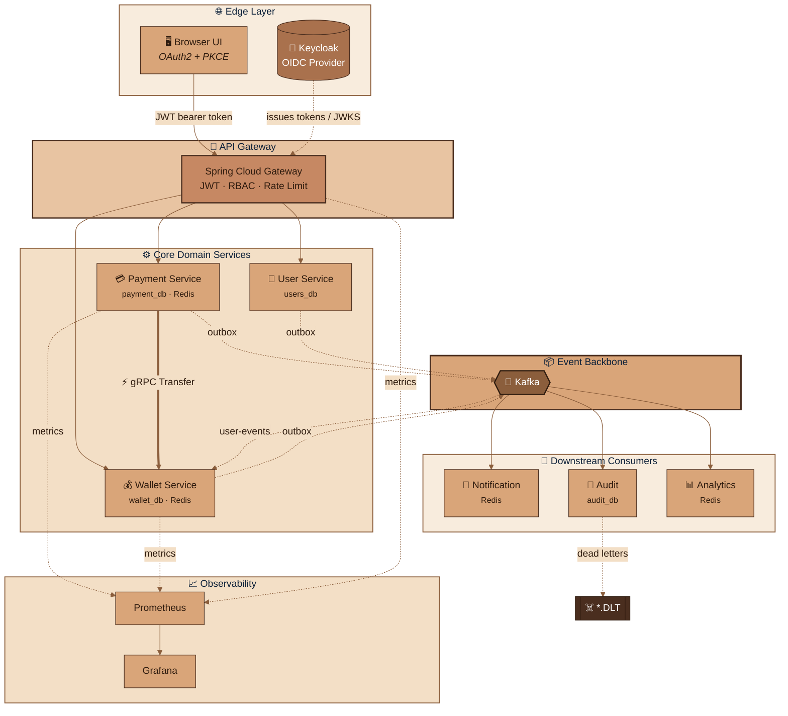

<div align="center">

# 💳 Event-Driven Distributed Payment Platform


<a href="https://github.com/Om20An00/FinFlow">
  
</a>

<br/>


### 🔗 [**Demo UI — localhost:3000**](http://localhost:3000) &nbsp;·&nbsp; [**Grafana — localhost:3001**](http://localhost:3001) &nbsp;·&nbsp; run it with one command below ⬇️

</div>

---

## 📖 About This Project

**FinFlow** is a production-style fintech backend built to demonstrate real distributed systems engineering. It's a full payment & wallet platform split across six Spring Boot microservices, talking to each other over **gRPC**, coordinated through a **transactional outbox → Kafka** pipeline, secured with **OAuth2/OIDC (Keycloak)**, and deployable to **Kubernetes** with autoscaling and health probes.

> 🧠 **Author's note:** Every service gateway, user, wallet, payment, notification, audit, and analytics the outbox relay, the idempotency layer, the gRPC contracts, and the observability stack were designed and built end to end as a hands on deep dive into how real payment infrastructure handles consistency, failure, and scale.

---

## 🏗️ Architecture

<div align="center">



</div>

---

## 📸 Demo

<div align="center">

| Landing Page | User Dashboard |
|:---:|:---:|
|  |  |

| Live Notifications & Wallet Ledger | Payment History |
|:---:|:---:|
|  |  |

| Demo Lab — Chaos & Resilience Tests | Demo Lab — Live Console Output |
|:---:|:---:|
|  |  |

| Admin & Audit — Freeze / Trace / DLQ | Real-Time Analytics Dashboard |
|:---:|:---:|
|  |  |

| In-App Architecture View | Prometheus — Service Discovery |
|:---:|:---:|
|  |  |

| Grafana — Payments & Latency | Grafana — Resilience & Outbox Metrics |
|:---:|:---:|
|  |  |

| Kafka UI — Topics & Dead Letter Queues | Kafka UI — Consumer Groups |
|:---:|:---:|
|  |  |

</div>

---

## ✨ Features

| Category | What's Implemented |
|---|---|
| **Distributed transactions** | Transactional outbox pattern (`OutboxService`, `OutboxRelay` with `FOR UPDATE SKIP LOCKED`) no dual write between Postgres and Kafka |
| **Service-to-service RPC** | gRPC with deadlines and correlation id propagation (`wallet.proto`, `WalletClient`) REST/JSON only at the browser edge |
| **Idempotency** | Redis + unique DB constraint on payment creation, `transfer_log` on wallet transfers, idempotent Kafka consumers (unique `event_id`) |
| **Concurrency control** | Optimistic locking (`@Version`) on wallet balances with jittered retry on conflict |
| **Reconciliation** | Background job retries `PENDING` payments safely, since the Transfer RPC is idempotent |
| **Kafka resilience** | 3 retries → dead letter topics (`<topic>.DLT`), manual ack, DLQ handling in the audit consumer |
| **AuthN/AuthZ** | OAuth2/OIDC via Keycloak, JWT validated independently at every service (gateway is not a trust boundary), RBAC via `@PreAuthorize` |
| **Rate limiting** | Redis token bucket limiter per user at the API gateway |
| **Observability** | Actuator + Micrometer custom metrics (`payment_success_total`, `wallet_operation_latency`, `kafka_dead_letters_total`), Grafana dashboard, correlation id traced across HTTP → gRPC → Kafka |
| **Database per service** | Isolated schemas with Flyway migrations per service |
| **Deployment** | Docker Compose for local dev; Kubernetes manifests with Deployments, probes, resource limits, HPA, and a headless service for gRPC load balancing |

---

## 🛠️ Tech Stack

<div align="center">


</div>

---

## 🚀 Run It (One Command)

**Requirements:** Docker Desktop (or Docker Engine + compose plugin), ~8 GB RAM free. Nothing else Maven and JDK 21 run inside Docker.

```bash
git clone https://github.com/Om20An00/FinFlow.git
cd FinFlow
./start.sh            # or: docker compose up --build -d
```

First build takes ~5–10 minutes (Maven downloads dependencies once, then it's cached). Then open **http://localhost:3000**.

| What | URL | Login |
|---|---|---|
| 🖥️ Demo UI | http://localhost:3000 | `alice/alice123` · `bob/bob123` · `merchant/merchant123` · `admin/admin123` |
| 🌐 API gateway | http://localhost:8080 | Bearer JWT |
| 🔐 Keycloak console | http://localhost:8180 | `admin/admin` |
| 📊 Grafana | http://localhost:3001 | anonymous dashboard *FinFlow · Platform Overview* |
| 📨 Kafka UI | http://localhost:8090 | – |
| 📈 Prometheus | http://localhost:9090 | – |

Stop and wipe everything: `./stop.sh` &nbsp;·&nbsp; end-to-end smoke test: `./scripts/smoke-test.sh`

---

## 🎬 Demo Script (≈4 minutes)

1. **Sign in** as `alice` note the redirect to the real Keycloak login page (OIDC + PKCE).
2. **Send money** to Bob watch the notification land (Kafka → Redis) and the ledger update. Badges show whether each read was served from Redis or Postgres.
3. **Demo Lab → Idempotent payments**: fire the same request twice, get charged once. **Concurrent transfers**: 6 parallel payments settle to the exact correct balance.
4. **Demo Lab → Rate limiting**: trigger `429`s. **RBAC**: `403` as Alice on an admin action. **No token**: `401`.
5. Send a payment with `#poison` in the note → sign in as `admin` → **Admin & Audit**: inspect the dead-lettered message, freeze Bob's wallet, trace the correlation id across services.
6. Open **Grafana** (payments/min, gRPC latency, consumer lag, DLQ counter) and **Kafka UI** (topics, consumer groups, `payments.DLT`).
7. `docker compose ps` everything healthy. On Kubernetes: `kubectl scale deployment payment-service --replicas=4` and watch the HPA react.

---

## 🧭 Feature → Code Map

| Topic | Implementation |
|---|---|
| OAuth2 / OIDC, JWT, RBAC | `infra/keycloak/finflow-realm.json`, `common/.../SecurityConfig.java`, `gateway/.../GatewaySecurityConfig.java`, `@PreAuthorize` |
| gRPC | `proto/src/main/proto/wallet.proto`, `wallet-service/.../grpc/*`, `payment-service/.../grpc/WalletClient.java` |
| Transactional outbox | `outbox/` module — `OutboxService`, `OutboxRelay` (`FOR UPDATE SKIP LOCKED`) |
| Idempotency | `PaymentService.create` (Redis + unique constraint), `WalletService.transfer` (`transfer_log`), idempotent consumers |
| Optimistic locking | `Wallet.@Version`, retry loop in `WalletGrpcService` |
| Reconciliation | `PaymentService.reconcilePending` |
| Kafka retry / DLQ | `KafkaCommonConfig` (3 retries, `<topic>.DLT`), `NotificationConsumer`, `AuditConsumer.onDeadLetter` |
| Database per service + Flyway | `*/src/main/resources/db/migration`, `infra/postgres/init.sql` |
| Redis | Wallet read cache (15s TTL), payment idempotency cache, gateway rate limiter, notifications, analytics counters |
| Rate limiting | Gateway `RequestRateLimiter` — Redis token bucket per user |
| Observability | Actuator + Micrometer, custom metrics, Grafana dashboard, correlation id across HTTP → gRPC → Kafka |
| Docker / Kubernetes | `Dockerfile`, `docker-compose.yml`, `k8s/` — Deployments, probes, resources, HPA, headless service for gRPC LB |

---

## ☸️ Kubernetes (Optional)

```bash
kind create cluster --name finflow     # or: minikube start --cpus 4 --memory 8192
./k8s/deploy.sh
kubectl -n finflow port-forward svc/ui 3000:80 &
kubectl -n finflow port-forward svc/gateway 8080:8080 &
kubectl -n finflow port-forward svc/keycloak 8180:8080 &
```

---

## 🌱 Design Decisions & Trade-offs (Interview Material)

- **Why gRPC only internally?** Binary, typed, HTTP/2 deadlines for latency-sensitive service-to-service calls; REST/JSON stays at the edge for browsers.
- **Why an outbox?** A DB transaction can't span PostgreSQL and Kafka. Writing the event in the same transaction and relaying it later gives at-least-once delivery without dual-write bugs consumers are idempotent, so duplicates are harmless.
- **Why is the gRPC call outside the DB transaction?** Holding a connection/locks during a network call is an availability risk. The trade-off is the `PENDING` state plus the reconciler.
- **Why optimistic locking?** Wallet contention is low; `@Version` avoids row locks and deadlocks, and conflicts retry with jittered backoff.
- **Why does every service re-validate the JWT?** The gateway isn't a trust boundary you should rely on alone.
- **Known simplifications:** one Postgres container hosting four databases (separate logins), single-broker Kafka, Keycloak in dev mode, HTTP instead of TLS, no service mesh/circuit breaker (Resilience4j is the natural next step), 15s wallet cache TTL. Each is called out because you should be able to explain what you'd change for production.

---

## 🧪 Troubleshooting

- `docker compose logs -f <service>` (e.g. `payment-service`). Services wait on Postgres/Kafka/Redis health checks, so the first minute of "restarts" is really just slow startup.
- **Login redirect fails:** open the UI at exactly `http://localhost:3000` (the Keycloak redirect URI) with Keycloak at `http://localhost:8180`.
- **401 after login:** token issuer must be `http://localhost:8180/realms/finflow` (`KC_HOSTNAME_URL`) don't change the Keycloak port mapping without updating `ISSUER` and `ui/public/config.js`.
- **Port already in use:** change the left side of the `ports:` mappings in `docker-compose.yml` (and `ui/public/config.js`).
- **Out of memory:** give Docker at least 6–8 GB (Settings → Resources).

---

## 🔮 Roadmap

- [ ] Resilience4j circuit breakers on the gRPC client
- [ ] mTLS between services (currently HTTP internally)
- [ ] Multi-broker Kafka cluster
- [ ] Saga-style multi-hop transfers (beyond single wallet-to-wallet)
- [ ] Contract tests for the gRPC + Kafka event schemas

---

## 👤 Author

**Om** — [@Om20An00](https://github.com/Om20An00)

Every service, the outbox relay, the idempotency layer, and the observability stack in this repository were designed and built end-to-end as an independent, hands-on project.

<div align="center">

If this project helped you or you found it interesting, consider giving it a ⭐!


</div>
